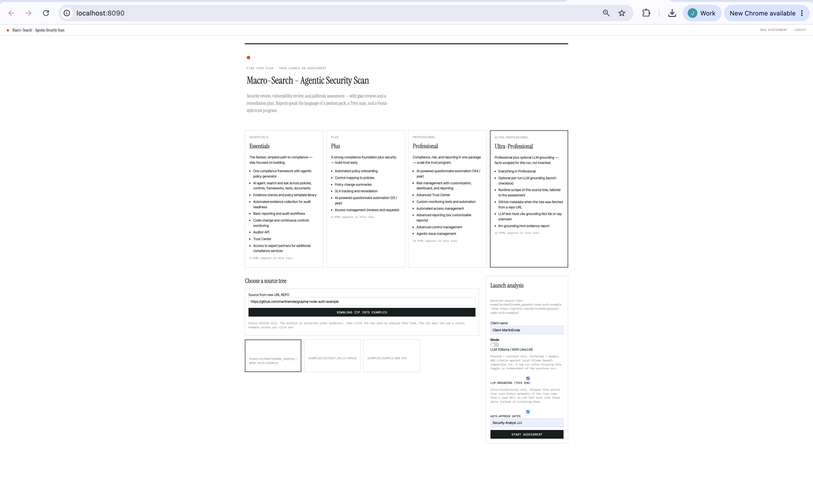

# Macro-Search - Agentic Security Scan

**Version 0.0.1** — gated, security-only assessment pipeline (pentest, Trivy, jailbreak / prompt-injection, CIS catalogue, Vanta-shaped trust program). Not a code translator.

Look and feel matches Micro-Cosmos (Instrument Serif, Inter Tight, IBM Plex Mono, sage panels, single red accent). Python import path is `agentic_security`.

This repository is clone-and-run: Docker Compose on port **8090**, or a local venv. Default login is `demo` / `demobxyz`.

## What this app is

A gated security assessment: pick Essentials / Plus / Professional, point at a source tree, approve gates, then read HTML reports. Three live screens from the Compose app:

**Landing — choose a plan and launch an assessment**



**Jailbreak and prompt-injection report**


**Access-management report (Plus / Professional)**


## Quick start (from a git clone)

```bash
git clone <this-repo-url> agentic-security-test-sdk
cd agentic-security-test-sdk
cp .env.example .env
docker compose up --build
```

Open http://localhost:8090 — sign in with `demo` / `demobxyz`.

On the launch form, **Deterministic** (toggle on, default) uses scanners only. Flip to **LLM (Ollama / ADK LiteLLM)** to call **gemma4:latest** on local Ollama. Compose uses `http://host.docker.internal:11434/v1` and maps `host.docker.internal` via `extra_hosts` (Linux + Docker Desktop). Host venv uses `http://localhost:11434/v1`.

```bash
# optional — LLM mode
ollama pull gemma4:latest   # or llama3.2:latest; set MODEL_REASONING in .env
```

Local (no Docker):

```bash
python3.12 -m venv .venv && source .venv/bin/activate
pip install -e ".[dev]"
# LLM mode also needs: pip install -e ".[llm]"
cp .env.example .env
uvicorn agentic_security.web.app:app --host 0.0.0.0 --port 8090
```

Tests:

```bash
pytest -v
```

## What a run does

```
Scope → Gate 1
→ Trivy / vuln scan → Gate 2
→ AppSec (OWASP WSTG / ASVS / CVSS findings) → Gate 3
→ Jailbreak catalogue (live probes in LLM mode) → Gate 4
→ CIS cloud controls → Gate 4.5 (remediation plan)
→ Trust / GRC pack (plan-gated) → Gate 5
→ HTML reports
```

Six human gates, same approve/reject pattern as Micro-Cosmos. Auto-approve is a launch-time toggle that needs an approver name.

## Plans (Vanta-shaped)

| Tier | Reports | Distinct extras |
|---|---|---|
| **Essentials** | pentest, Trivy, executive summary | 1 framework, policy templates, evidence map, Trust Center entitlement |
| **Plus** | + jailbreak, access management, policy-control map | 25 questionnaires / year, SLA tracking, access reviews |
| **Professional** | + risk register, CIS cloud, ASVS, issue management, full pack | 144 questionnaires / year, custom monitoring, agentic issues |

## Reports

HTML lives under `runs/<id>/reports/` (created at runtime; not committed). The pentest report follows the XYZ Reality 2022 pack's metric surface (histogram, CVSS bands, root-cause buckets, scope, personnel, findings with evidence, WSTG / OWASP Top 10 appendix). Plus/Professional reports include a full access-management inventory (not an entitlement stub), live-or-catalogue jailbreak probes, CIS status, ASVS chapter matrix, risk register, and issue board.

On the Reports tab, **Generate output report** downloads one A4 PDF with every report in that run, **executive summary first**. The iframe “full pack” HTML is omitted so each section appears once.

## Layout

| Path | Role |
|---|---|
| `agentic_security/` | Application package |
| `examples/sample-web-api/` | Deliberate pickle / TLS / password fixture |
| `images/` | Product screenshots used in this README |
| `tests/` | Pytest suite + markup results |
| `docker-compose.yml` / `Dockerfile` | Compose on 8090; image includes Trivy, WeasyPrint (A4 PDF), and the `[llm]` extra |
| `.env.example` | Ollama / skip_llm / demo credentials |
| `transferable-skills/` | Project skills for later agent sessions |

## Skills

See `transferable-skills/README.md`. Read those files in a new agent session; they are not Cursor marketplace skills.
