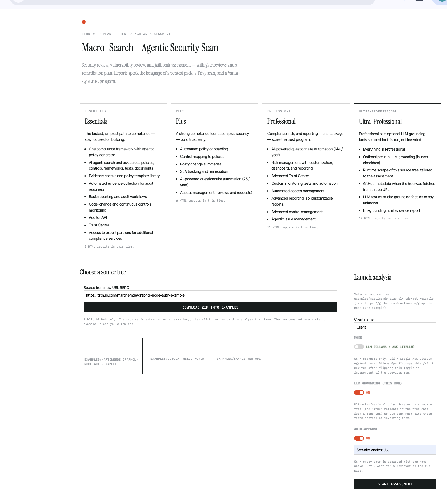
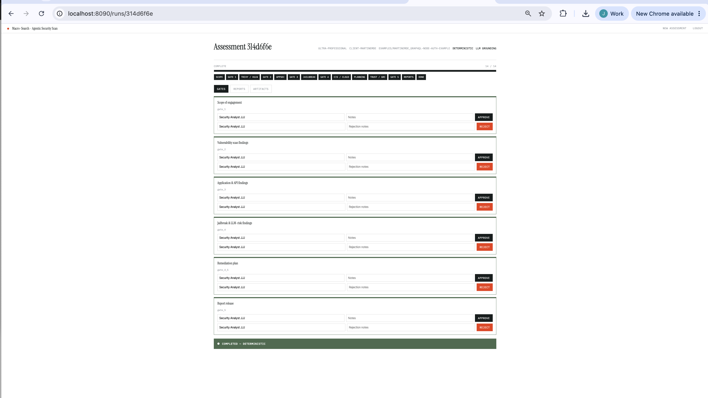
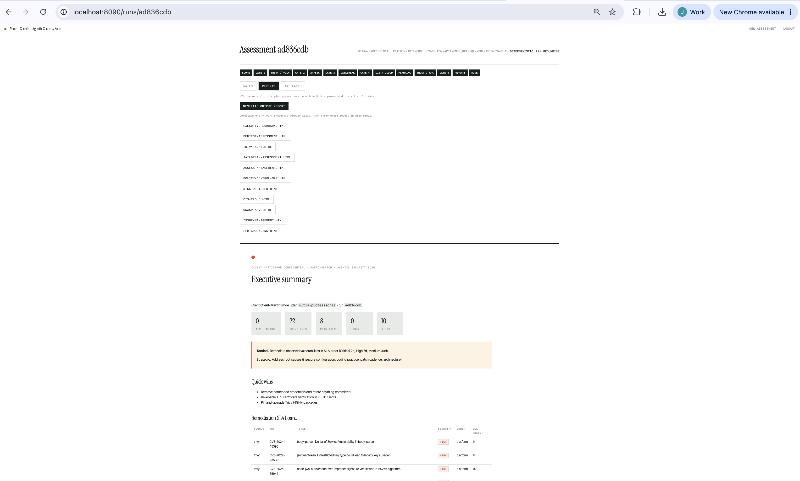
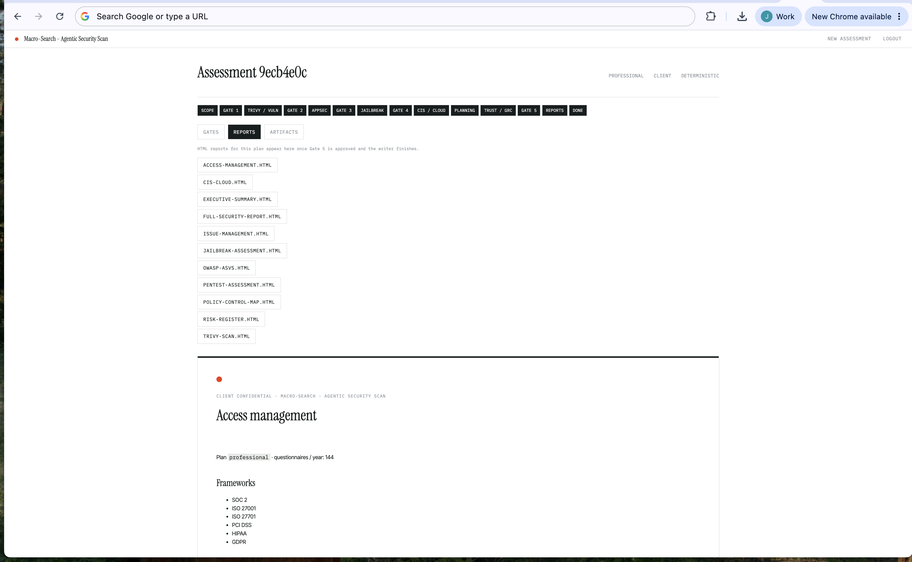

# Macro-Search - Agentic Security Scan

**Version 0.0.1** — gated, security-only assessment pipeline (pentest, Trivy, jailbreak / prompt-injection, CIS catalogue, Vanta-shaped trust program). Not a code translator.

Look and feel matches Micro-Cosmos (Instrument Serif, Inter Tight, IBM Plex Mono, sage panels, single red accent). Python import path is `agentic_security`.

This folder is a standalone LangGraph deployment: its own `docker-compose.yml` and its own `llm-gateway`. Default profile is **ollama** / **gemma4:latest**. App on port **8090**, gateway on **4000**. Default login is `demo` / `demobxyz`. Run this stack or `google-cloud-showcase`, not both — they bind the same host ports.

## What this app is

A gated security assessment: pick Essentials / Plus / Professional / Ultra-Professional, click a source-tree card (or download a public GitHub zip into `examples/` first), approve gates, then read HTML reports. Five live screens from the Compose app — filenames match the product surface they show:

**Landing page** — four plan cards (Ultra-Professional included), **Source from new URL REPO**, example picker, then three matching **toggle switches** in Launch analysis: Deterministic / LLM, LLM grounding, Auto-approve.



**Completed run** — the assessment page after the pipeline finishes: every phase pill filled, gates resolved, and the green **Completed — Deterministic** (or LLM) banner below the gates.



**Executive summary** — run Reports tab after Gate 6: **Generate output report** (A4 PDF, executive summary first), Client name on the cover, Ultra-Professional + LLM grounding when that extra was on.



**Jailbreak & prompt-injection** — catalogue of six probe families (live probes in LLM mode; deterministic maps the surface and records test cases). Plus / Professional / Ultra-Professional.


**Access management report** — identity frameworks, reviews, and JML inventory (Plus / Professional / Ultra-Professional), not an entitlement stub.



## Quick start (from a git clone)

```bash
git clone <this-repo-url> agentic-security-test-sdk
cd agentic-security-test-sdk
cp .env.example .env
docker compose up --build
```

Open http://localhost:8090 — sign in with `demo` / `demobxyz`.

On the launch form, **Deterministic** (toggle on, default) uses scanners only. Flip to **LLM (LangGraph / gateway)** to call **gemma4:latest** through this folder’s **`llm-gateway`** (OpenAI `/v1` proxy on port **4000**). The app uses LangGraph and LangChain `ChatOpenAI`, not Google ADK. The gateway’s active profile is **ollama**; LM Studio, AWS Bedrock, and Vertex AI Gemini are declared but dormant — switch with `LLM_PROFILE` in `.env` and `docker compose up -d llm-gateway` (no silent failover). That launch choice is fixed for the run. Watch app traffic with `docker compose logs -f agentic-security` (`openai-v1 request|response`, `started_at` / `ended_at` / `duration_ms`, `./logs/openai-v1.log` and `./logs/agentic-security.log`) and the proxy with `docker compose logs -f llm-gateway` plus `./logs/llm-gateway.log` (JSON timeframes: `call_start`, `call_end`, `duration_ms`, `upstream_ms`). Host venv without Compose still uses `http://localhost:11434/v1`.

**Choose a source tree** by clicking an examples card (nothing is pre-selected). **Source from new URL REPO** downloads a public GitHub zip into `examples/` (bind-mounted into Compose); click the new card, then Start assessment. That downloaded tree is the pipeline source — not a leftover Target URL against the static sample.

```bash
# optional — LLM mode (Ollama on the host; gateway profile ollama)
ollama pull gemma4:latest   # or llama3.2:latest; set MODEL_REASONING + OLLAMA_LITELLM_MODEL
```

Switch the dormant gateway profiles (restart **only** the proxy — the app keeps the same `/v1` URL):

```bash
# .env
# LLM_PROFILE=lmstudio   # host LM Studio :1234
# LLM_PROFILE=bedrock    # AWS keys + BEDROCK_LITELLM_MODEL
# LLM_PROFILE=vertex     # GCP project + mounted llm-gateway/secrets/gcp-sa.json
docker compose up -d llm-gateway
```

Local (no Docker):

```bash
python3.12 -m venv .venv && source .venv/bin/activate
pip install -e ".[dev]"
# LLM mode also needs: pip install -e ".[llm]"
cp .env.example .env
uvicorn agentic_security.web.app:app --host 0.0.0.0 --port 8090
```

Tests (Compose container is the source of truth):

```bash
pytest -v
# or
docker compose exec agentic-security pytest -v -W error::DeprecationWarning
```

Markup: `tests/README.md` (54-row grid) and `tests/RESULTS.md`.

## Logs

Compose bind-mounts `./logs` into both services (`/app/logs`). Prompt bodies are never written.

| File / stream | Service | Timeframes |
|---|---|---|
| `docker compose logs -f agentic-security` | app | UTC `started_at` / `ended_at` / `duration_ms` on `openai-v1 request\|response` |
| `./logs/openai-v1.log` | app | Same `/v1` lines |
| `./logs/agentic-security.log` | app | Package log, same UTC clock |
| `docker compose logs -f llm-gateway` | proxy | DEBUG + `--detailed_debug` |
| `./logs/llm-gateway.log` | proxy | JSON `call_start` / `call_end` / `duration_ms` / `upstream_ms` / `overhead_ms` |

```bash
docker compose logs -f llm-gateway agentic-security
tail -f logs/llm-gateway.log logs/openai-v1.log
```

## What a run does

```
Scope → Gate 1
→ Trivy / vuln scan → Gate 2
→ AppSec (OWASP WSTG / ASVS / CVSS findings) → Gate 3
→ Jailbreak catalogue (live probes in LLM mode) → Gate 4
→ CIS cloud controls → Gate 5 (remediation plan)
→ Trust / GRC pack (plan-gated) → Gate 6
→ HTML reports
```

Six human gates, numbered **1–6** (the former planning checkpoint 4.5 is Gate 5; report release is Gate 6). Same approve/reject pattern as Micro-Cosmos. Auto-approve is a launch-time toggle that needs an approver name.

## Plans (Vanta-shaped)

| Tier | Reports | Distinct extras |
|---|---|---|
| **Essentials** | pentest, Trivy, executive summary | 1 framework, policy templates, evidence map, Trust Center entitlement |
| **Plus** | + jailbreak, access management, policy-control map | 25 questionnaires / year, SLA tracking, access reviews |
| **Professional** | + risk register, CIS cloud, ASVS, issue management, full pack | 144 questionnaires / year, custom monitoring, agentic issues |
| **Ultra-Professional** | + `llm-grounding.html` | Optional **LLM grounding** checkbox: scrape this run's tree (and GitHub metadata if the tree came from a repo URL) so LLM text cites `G-00n` facts instead of inventing them |

## Reports

HTML lives under `runs/<id>/reports/` (created at runtime; not committed). The pentest report uses the launch-form **Client name** (default `Client`) and the standard metric surface (histogram, CVSS bands, root-cause buckets, scope, personnel, findings with evidence, WSTG / OWASP Top 10 appendix). Plus/Professional reports include a full access-management inventory (not an entitlement stub), live-or-catalogue jailbreak probes, CIS status, ASVS chapter matrix, risk register, and issue board.

On the Reports tab, **Generate output report** downloads one A4 PDF with every report in that run, **executive summary first**. The iframe “full pack” HTML is omitted so each section appears once.

## Layout

| Path | Role |
|---|---|
| `agentic_security/` | Application package |
| `examples/sample-web-api/` | Bundled fixture; other `examples/` trees come from **Source from new URL REPO** |
| `images/` | Five product screenshots used above (landing, completed run, executive summary, jailbreak, access management) |
| `tests/` | Pytest suite + markup results |
| `docker-compose.yml` / `Dockerfile` | This folder’s app on 8090 and its own `llm-gateway` on 4000; image includes Trivy, WeasyPrint, LangGraph `[llm]` extra |
| `llm-gateway/profiles/` | One YAML per destination (`ollama` active; `lmstudio` / `bedrock` / `vertex` dormant) plus `custom_callbacks.py` (UTC timeframes) |
| `logs/` | Runtime only (gitignored): `openai-v1.log`, `agentic-security.log`, `llm-gateway.log` |
| `.env.example` | `LLM_PROFILE`, gateway key, skip_llm, demo credentials |
| `transferable-skills/` | Project skills for later agent sessions |

## Skills

See `transferable-skills/README.md`. Read those files in a new agent session; they are not Cursor marketplace skills.
